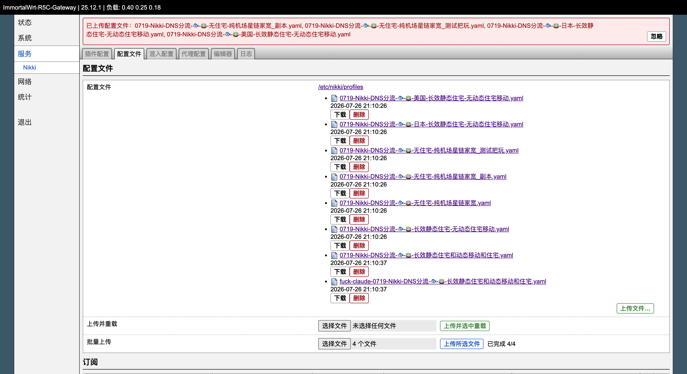

# Nikki 配置文件上传增强补丁

这是基于原版 [OpenWrt-nikki](https://github.com/nikkinikki-org/OpenWrt-nikki) 的 LuCI patch。

本仓库支持两种安装方式：

- 从 0 安装原版 Nikki，并自动应用当前魔改补丁。
- 对已经安装原版 Nikki / luci-app-nikki 的设备直接应用补丁。

## 功能

- 保留原版“只上传配置文件”能力。
- 新增“批量上传”按钮，可一次选择多个本地 `.yaml` / `.yml`，只上传到 `/etc/nikki/profiles/`，不选中、不重载。
- 新增“上传并选中重载”联合按钮。
- 在全局 `procd` 配置新增“重载后清除旧连接”开关，Nikki 重载后自动关闭 Mihomo 旧连接，让客户端按新配置重新连接。
- 选择单个本地 `.yaml` / `.yml` 后，一键完成：
  - 上传到 `/etc/nikki/profiles/`
  - 设为当前 Nikki profile
  - 重载 Nikki
  - 检查 Nikki 运行状态
  - 显示成功或失败通知

## 效果截图



## 从 0 安装

适用于未安装 Nikki 的设备。脚本会先安装原版 Nikki 基础包，再应用当前 fork 的 LuCI/RPC 魔改补丁。
默认从当前 fork 的最新 `main` 分支拉取文件，不固定到某个 tag 或 commit。

在 OpenWrt 设备 SSH 中执行。优先使用直连安装：

```shell
export GITHUB_PROXY=
export NIKKI_PATCH_RAW_BASE="https://raw.githubusercontent.com/yanjinbin/OpenWrt-nikki/main"
export NIKKI_UPSTREAM_RAW_BASE="https://raw.githubusercontent.com/nikkinikki-org/OpenWrt-nikki/main"

wget -O - "$NIKKI_PATCH_RAW_BASE/install-patched.sh?ts=$(date +%s)" | ash
```

如果直连 GitHub raw 不通，再使用代理安装：

```shell
wget -O - "https://gh-proxy.com/https://github.com/yanjinbin/OpenWrt-nikki/raw/refs/heads/main/install-patched.sh?ts=$(date +%s)" | ash
```

## 已安装 Nikki 后应用补丁

适用于已经安装原版 Nikki / luci-app-nikki 的设备。
默认从当前 fork 的最新 `main` 分支拉取文件，不固定到某个 tag 或 commit。

在 OpenWrt 设备 SSH 中执行。优先使用直连安装：

```shell
export GITHUB_PROXY=
export NIKKI_RAW_BASE="https://raw.githubusercontent.com/yanjinbin/OpenWrt-nikki/main"

wget -O - "$NIKKI_RAW_BASE/install-luci-patch.sh?ts=$(date +%s)" | ash
```

如果直连 GitHub raw 不通，再使用代理安装：

```shell
wget -O - "https://gh-proxy.com/https://github.com/yanjinbin/OpenWrt-nikki/raw/refs/heads/main/install-luci-patch.sh?ts=$(date +%s)" | ash
```

补丁脚本会覆盖以下运行文件：

```text
/www/luci-static/resources/tools/nikki.js
/www/luci-static/resources/view/nikki/app.js
/www/luci-static/resources/view/nikki/profile.js
/usr/share/rpcd/ucode/luci.nikki
/etc/init.d/nikki
```

并自动执行：

```shell
uci set nikki.procd.clear_connections_on_reload='1'   # 仅在该项不存在时写入
/etc/init.d/rpcd restart
/etc/init.d/uhttpd restart
rm -rf /tmp/luci-indexcache* /tmp/luci-modulecache*
```

安装后强制刷新浏览器，进入：

```text
服务 -> Nikki -> 配置文件
```

如果页面仍看不到“批量上传”，先确认路由器实际服务的新文件：

```shell
wget -q -O - "http://127.0.0.1/luci-static/resources/view/nikki/profile.js?ts=$(date +%s)" | grep "批量上传"
wget -q -O - "http://127.0.0.1/luci-static/resources/view/nikki/app.js?ts=$(date +%s)" | grep "Clear Connections After Reload"
grep "clear_connections_after_reload" /etc/init.d/nikki
```

能看到输出但浏览器没有变化时，关闭当前 Nikki 配置文件页后重新打开，或使用无痕窗口重新登录 LuCI。

## 卸载 / 回滚

重新安装原版 `luci-app-nikki` 即可回滚本补丁。需要完整卸载 Nikki 时，请使用原版 OpenWrt-nikki 的卸载方式。

opkg 系统：

```shell
opkg update
opkg install --force-reinstall luci-app-nikki
/etc/init.d/rpcd restart
/etc/init.d/uhttpd restart
rm -rf /tmp/luci-indexcache* /tmp/luci-modulecache*
```

apk 系统：

```shell
apk update
apk fix luci-app-nikki
/etc/init.d/rpcd restart
/etc/init.d/uhttpd restart
rm -rf /tmp/luci-indexcache* /tmp/luci-modulecache*
```

## 注意事项

- 该补丁会修改 LuCI/RPC 文件和 `/etc/init.d/nikki` 服务脚本，不替换 `mihomo` 核心包。
- 如果后续升级原版 `luci-app-nikki`，本补丁可能会被覆盖，需要重新执行安装命令。
- 如果 `gh-proxy.com` 返回 429 或不可用，使用上面的“直连安装”命令。

## 编译

```shell
# 添加源
echo "src-git nikki https://github.com/yanjinbin/OpenWrt-nikki.git;main" >> "feeds.conf.default"
# 更新并安装源
./scripts/feeds update -a
./scripts/feeds install -a
# 编译
make package/luci-app-nikki/compile
```

编译结果可以在 `bin/packages/your_architecture/nikki` 内找到。

## 依赖

- ca-bundle
- curl
- yq
- firewall4
- ip-full
- kmod-inet-diag
- kmod-nft-socket
- kmod-nft-tproxy
- kmod-tun
- kmod-dummy

## 贡献者

[](https://github.com/nikkinikki-org/OpenWrt-nikki/graphs/contributors)

## 特别感谢

- [@ApoisL](https://github.com/apoiston)
- [@xishang0128](https://github.com/xishang0128)
