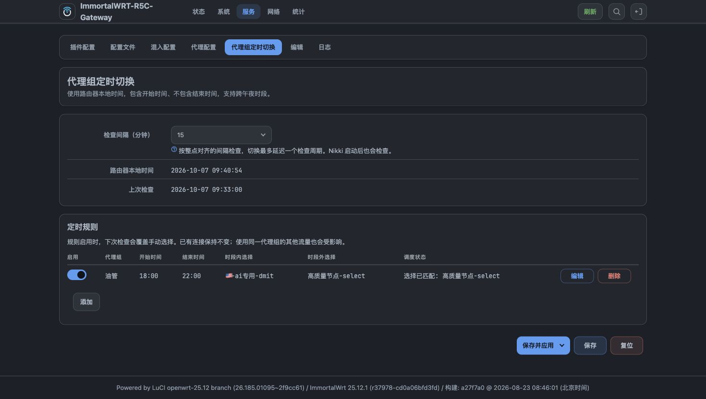
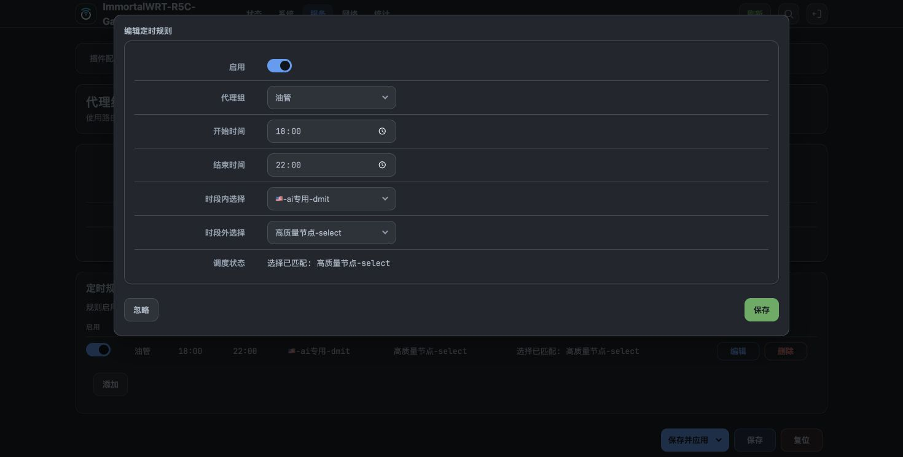
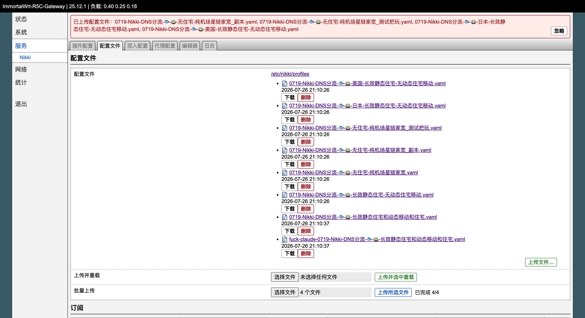

# Nikki 配置文件上传增强补丁

这是基于原版 [OpenWrt-nikki](https://github.com/nikkinikki-org/OpenWrt-nikki) 的 LuCI patch。

本仓库支持两种安装方式：

- 从 0 安装原版 Nikki，并自动应用当前魔改补丁。
- 对已经安装原版 Nikki / luci-app-nikki 的设备直接应用补丁。

## 功能

- 新增“代理组定时切换”页面：选择代理组、每日时段、时段内目标，支持多条规则及跨午夜时段。时段外保持当前选择。检查间隔可选 1、5、10、15、30、60 分钟。
- 每条订阅可选择更新星期（支持多选）和更新时间，默认每周日凌晨 `04:00`，按路由器本地时间执行。取消按小时或每隔几天更新。
- “插件配置”页面在配置文件选择器下方显示当前订阅的定时更新开关、更新星期和时间，与“配置文件”页面读写同一份设置；选择本地文件时隐藏。
- 更新失败保留旧配置、上次成功时间和流量信息，等待下个选定时点。下载通过 YAML 和 Mihomo 检查后才替换；仅当前使用的订阅更新成功后重载 Nikki。
- 支持向 HTTPS 接口上报失败来源：设备名称、订阅名称、订阅服务器、失败原因、时间和 HTTP/curl 状态。上报不包含订阅 URL 或密码；上报失败不会中断服务。
- 保留原版“只上传配置文件”能力。
- 新增“批量上传”按钮，可一次选择多个本地 `.yaml` / `.yml`，只上传到 `/etc/nikki/profiles/`，不选中、不重载。
- 新增“上传并选中重载”联合按钮。
- 在全局 `procd` 配置新增“重载后清除旧连接”开关，Nikki 重载后自动关闭 Mihomo 旧连接，让客户端按新配置重新连接。
- 选择单个本地 `.yaml` / `.yml` 后，一键完成：
  - 上传到 `/etc/nikki/profiles/`
  - 设为当前 Nikki profile
  - 重载 Nikki
  - 检查 Nikki 运行状态
  - 显示成功或失败通知

## 代理组定时切换

进入 **服务 → Nikki → 代理组定时切换**。页面通过当前运行配置中的 Mihomo API 读取手动选择（Selector）代理组及其可选项。组名与时段内目标均使用下拉选择，启停用复选框；无需手工输入名称、API 地址或密钥。节点名、组名中的中文、空格和 emoji 会原样保存。开始与结束时间使用浏览器原生时分选择器，精确到分钟；界面随浏览器和系统语言显示，保存为 24 小时制 `HH:MM`。

例如，选择“油管”组，开始时间 `18:00`、结束时间 `22:00`，时段内选择 `🇺🇸-ai专用-dmit`，启用后保存并应用。请从实际 API 返回的下拉选项选择完整名称。

- 检查间隔是所有规则共用的设置，默认 1 分钟。5 分钟表示每小时的 `00、05、10…55` 分检查，60 分钟表示每小时整点检查；切换最多延迟一个检查周期。
- 时段包含开始时间、不包含结束时间。例如 `18:00–22:00` 在 `22:00` 起停止切换，保留当前选择；`22:00–06:00` 表示跨午夜时段。使用路由器本地时间，开始与结束时间不能相同。
- OpenWrt cron 启动一次性进程。进程获取文件锁后读取规则和当前选择，仅在时段内且选择不一致时通过 [Mihomo API](https://wiki.metacubex.one/api/) 切换，不依赖流量触发，不重启 Nikki，也不主动关闭已有连接。调度保存在独立的 `nikki_schedule` 配置中，仅修改调度时“保存并应用”不会触发核心重载。若同时有其他未应用的 LuCI 改动，标准“保存并应用”仍会一起应用。旧连接可能继续使用原出口，直到应用新建连接。
- 每个 API 请求最多 5 秒。上一轮未结束时跳过本轮；执行结束或进程退出后释放内存、文件句柄和锁。没有额外常驻服务，也不需要 Mac 在线。
- Nikki 启动后会检查一次；若 API 尚未就绪，下一分钟重试；修改规则或间隔后也在下一分钟检查。API 失败、组名变更、选项消失时保留当前选择；页面显示错误，相同错误不重复刷日志。
- 同一代理组可启用多条互不重叠的时段规则，支持跨午夜；首尾相接不算重叠。重叠时阻止保存，并显示冲突组名和时间段；手工配置的重叠规则全部跳过。规则启用后，时段内的手动选择会在下一轮被校正；时段外不干预。停用或删除规则后保留最后一次选择。
- 其他引用该组的流量也会受到影响。例如“节点选择”引用“油管”时，切换可能影响 YouTube 以外的流量。

UCI 示例（名称须替换为运行时的完整名称）：

```uci
config proxy_schedule
    option enabled '1'
    option group '油管'
    option start_time '18:00'
    option end_time '22:00'
    option inside '🇺🇸-ai专用-dmit'
```

规则和全局间隔都在 `/etc/config/nikki_schedule`，间隔字段为 `nikki_schedule.config.proxy_schedule_interval`。安装包不带启用规则，新增规则默认停用。未创建或启用规则时不会执行 API 请求。

状态保存在 RAM 的 `/var/run/nikki/proxy_schedule.json`，页面每 15 秒读取状态。调度只记录切换和变化的错误；详细实现与排查见 [调度说明](docs/proxy-schedule.md)。

### 本地验证

需要 Node.js、Python 3，以及带 `fs` 模块的 ucode：

```sh
node --test tests/*.test.mjs
python3 -m unittest discover -s tests
sh -n nikki/files/nikki.init
sh -n install-luci-patch.sh
```

非系统安装的 ucode 可通过 `UCODE` 指定可执行文件、`UCODE_LIB` 指定模块目录。测试使用本地 HTTP 服务，不访问路由器。

## 效果截图

R5C 实机：代理组定时切换，显示检查间隔、当前目标和调度结果。下图的 15 分钟及规则为用户配置示例，安装默认间隔为 1 分钟，默认不启用任何规则。



编辑规则时，代理组和目标使用下拉选择，开始与结束时间使用原生时分选择器。点击时间字段右侧的时钟图标即可选择时间；选择器外观随浏览器和系统变化。



批量上传和上传并选中重载：



## 订阅失败上报

在“配置文件”页面填写设备来源、HTTPS 上报地址和上报令牌。设备来源留空时使用路由器主机名；上报地址留空时关闭上报。
OralCure 订阅服务接收地址为 `https://<subscription-host>/api/subscription-failures`，上报令牌使用该服务的订阅令牌。
轮换订阅令牌后需要同步更新此设置。接收端在服务日志中记录设备名称和客户端 IP。

定时任务每分钟检查一次，仅在选定星期和时间下载。同一订阅在同一个计划分钟最多尝试一次，手动更新不改变下次计划时间。关闭 Nikki 时不会执行；关机或任务繁忙错过的时点不补跑，失败也不在当天其他时间自动重试。失败后仍可手动更新。
升级时移除旧的 `update_interval`，未配置星期和时间的订阅迁移为每周日 `04:00`；保留原来的定时更新开关、已有星期时间、订阅链接和更新历史。安装补丁仅更新 cron，不立即下载订阅或重载 Mihomo。

例如每周一、周四凌晨 04:00 更新：

```uci
config subscription 'subscription'
    option auto_update '1'
    list update_weekdays '1'
    list update_weekdays '4'
    option update_time '04:00'
```

星期使用 `0`（周日）至 `6`（周六）。夜间调度只控制更新时间；当前订阅更新成功仍走原有重载流程，不能保证更新时连接不中断。

失败上报最多等待 10 秒，不持久化重试；如果订阅服务或网络同时不可用，只在 Nikki 日志中记录上报失败。
补丁安装要求设备提供 `flock` 和 `/usr/share/libubox/jshn.sh`。

本地回归测试：

```sh
python3 -m unittest discover -s tests -v
```

## 从 0 安装

适用于未安装 Nikki 的设备。脚本会先安装原版 Nikki 基础包，再应用当前 fork 的 LuCI/RPC 魔改补丁。
默认从当前 fork 的最新 `main` 分支拉取文件，不固定到某个 tag 或 commit。

在 OpenWrt 设备 SSH 中执行。优先使用直连安装：

```shell
export GITHUB_PROXY=
export NIKKI_PATCH_RAW_BASE="https://raw.githubusercontent.com/yanjinbin/OpenWrt-nikki/main"
export NIKKI_UPSTREAM_RAW_BASE="https://raw.githubusercontent.com/nikkinikki-org/OpenWrt-nikki/main"

wget -O - "$NIKKI_PATCH_RAW_BASE/install-patched.sh?ts=$(date +%s)" | ash
```

如果直连 GitHub raw 不通，再使用代理安装：

```shell
wget -O - "https://gh-proxy.com/https://github.com/yanjinbin/OpenWrt-nikki/raw/refs/heads/main/install-patched.sh?ts=$(date +%s)" | ash
```

## 已安装 Nikki 后应用补丁

适用于已经安装原版 Nikki / luci-app-nikki 的设备。
默认从当前 fork 的最新 `main` 分支拉取文件，不固定到某个 tag 或 commit。

在 OpenWrt 设备 SSH 中执行。优先使用直连安装：

```shell
export GITHUB_PROXY=
export NIKKI_RAW_BASE="https://raw.githubusercontent.com/yanjinbin/OpenWrt-nikki/main"

wget -O - "$NIKKI_RAW_BASE/install-luci-patch.sh?ts=$(date +%s)" | ash
```

如果直连 GitHub raw 不通，再使用代理安装：

```shell
wget -O - "https://gh-proxy.com/https://github.com/yanjinbin/OpenWrt-nikki/raw/refs/heads/main/install-luci-patch.sh?ts=$(date +%s)" | ash
```

补丁脚本会覆盖以下运行文件：

```text
/www/luci-static/resources/tools/nikki.js
/www/luci-static/resources/view/nikki/app.js
/www/luci-static/resources/view/nikki/profile.js
/www/luci-static/resources/view/nikki/schedule.js
/usr/share/luci/menu.d/luci-app-nikki.json
/usr/share/rpcd/ucode/luci.nikki
/usr/share/rpcd/acl.d/luci-app-nikki.json
/etc/config/nikki_schedule
/etc/nikki/ucode/proxy_schedule.uc
/etc/nikki/ucode/schedule.uc
/etc/init.d/nikki
```

并自动执行：

```shell
uci set nikki.procd.clear_connections_on_reload='1'   # 仅在该项不存在时写入
/etc/init.d/rpcd restart
/etc/init.d/uhttpd restart
rm -rf /tmp/luci-indexcache* /tmp/luci-modulecache*
```

安装后强制刷新浏览器，进入：

```text
服务 -> Nikki -> 配置文件
```

如果页面仍看不到“批量上传”，先确认路由器实际服务的新文件：

```shell
wget -q -O - "http://127.0.0.1/luci-static/resources/view/nikki/profile.js?ts=$(date +%s)" | grep "批量上传"
wget -q -O - "http://127.0.0.1/luci-static/resources/view/nikki/app.js?ts=$(date +%s)" | grep "Clear Connections After Reload"
grep "clear_connections_after_reload" /etc/init.d/nikki
```

能看到输出但浏览器没有变化时，关闭当前 Nikki 配置文件页后重新打开，或使用无痕窗口重新登录 LuCI。

## 卸载 / 回滚

先停用定时规则，再重新安装原版 `nikki` 和 `luci-app-nikki`，恢复服务脚本与界面。原版包不会自动删除补丁新增的文件。完整卸载 Nikki 请使用原版 OpenWrt-nikki 的卸载方式。

opkg 系统：

```shell
opkg update
opkg install --force-reinstall nikki luci-app-nikki
/etc/init.d/rpcd restart
/etc/init.d/uhttpd restart
rm -rf /tmp/luci-indexcache* /tmp/luci-modulecache*
```

apk 系统：

```shell
apk update
apk fix nikki luci-app-nikki
/etc/init.d/rpcd restart
/etc/init.d/uhttpd restart
rm -rf /tmp/luci-indexcache* /tmp/luci-modulecache*
```

## 注意事项

- 该补丁会修改 LuCI/RPC 文件和 `/etc/init.d/nikki` 服务脚本，不替换 `mihomo` 核心包。
- 补丁安装会刷新运行中的 cron 调度，无需重启 Mihomo。包构建包含简体中文翻译；仅覆盖源码的补丁安装在旧翻译包上可能显示英文标签。
- 如果后续升级原版 `luci-app-nikki`，本补丁可能会被覆盖，需要重新执行安装命令。
- 如果 `gh-proxy.com` 返回 429 或不可用，使用上面的“直连安装”命令。

## 编译

```shell
# 添加源
echo "src-git nikki https://github.com/yanjinbin/OpenWrt-nikki.git;main" >> "feeds.conf.default"
# 更新并安装源
./scripts/feeds update -a
./scripts/feeds install -a
# 编译
make package/luci-app-nikki/compile
```

编译结果可以在 `bin/packages/your_architecture/nikki` 内找到。

### GitHub Actions 构建安装包

`.github/workflows/build-install-packages.yml` 会在 `main` 分支相关源码变更
或手动运行时构建当前设备常用的 `aarch64_generic` 包：

- OpenWrt 24.10：生成 `.ipk`（opkg）
- OpenWrt 25.12：生成 `.apk`（apk）
- Athena / aarch64_cortex-a53 opkg：使用 24.10 SDK 生成 `.ipk`

每个任务完成后，安装包和对应的 feed 索引会作为 Actions artifact 提供下载。
构建包含 `nikki`、`luci-app-nikki` 以及 `mihomo-alpha`、`mihomo-meta`。

## 依赖

- ca-bundle
- curl
- yq
- firewall4
- ip-full
- kmod-inet-diag
- kmod-nft-socket
- kmod-nft-tproxy
- kmod-tun
- kmod-dummy

## 贡献者

[](https://github.com/nikkinikki-org/OpenWrt-nikki/graphs/contributors)

## 特别感谢

- [@ApoisL](https://github.com/apoiston)
- [@xishang0128](https://github.com/xishang0128)
